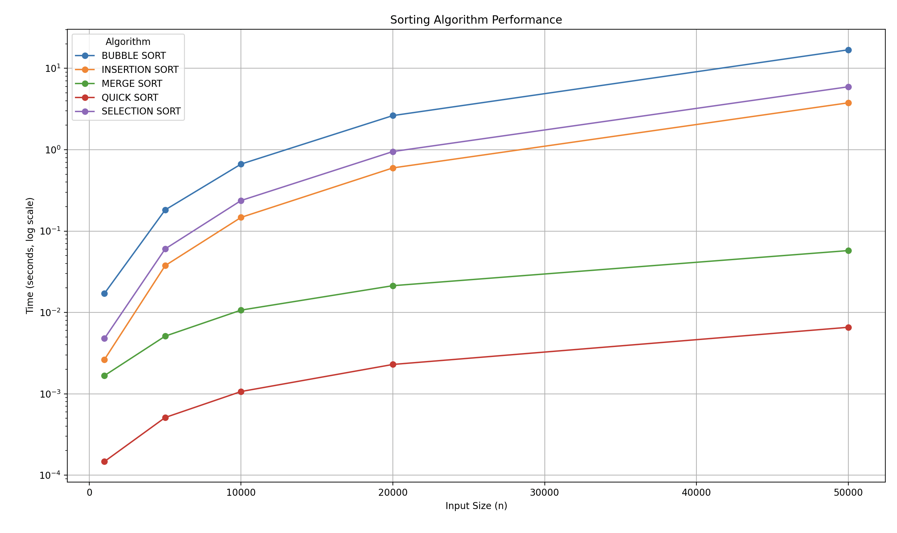

# Sorting Algorithm Visualizer (C++): 

## Overview:
This project implements and analyzes five common sorting algorithms in C++. Each algorithm is used to sort <strong>randomized</strong> arrays of varying sizes, from 1000 to 50,000 elements. The program then measures the time taken by each algorithm to sort these arrays and writes these results to a CSV file. 

A python script (plot.py) then reads the CSV data and visualizes the performance of each sorting algorithm using Matplotlib. The resulting plot, which shows the sorting time(in seconds and in <strong>log scale</strong>) as a function of array size (n), is attatched at the bottom of this README. 

## Algorithms: 
**1. Bubble Sort**:
   - Simplest Sorting algorithm; works by repeatedly stepping through the list, comparing adjacent elements and swapping them if they are in the wrong order. 
   - Time Complexity: $O(n^2)$

**2. Selection Sort**:
   - Algorithm works by repeatedly finding the minimum value of each unsorted subarray in the full array and putting it at the beginning of the subarray. At the end of the sort, the full array will be sorted. 
   - Time Complexity: $O(n^2)$

**3. Insertion Sort**:
   - Sorts elements in the array by extracting and inserting the element in the correct spot (like sorting your hand of playing cards) 
   - Time Complexity: $O(n^2)$

**4. Quick Sort**
   - Highly efficient sorting algorithm, works by partioning and sorting based on a pivot.  
   - Time Complexity: $O(n \log n)$ (Linearithmic)

**5. Merge Sort**
   - A Highly efficient, stable, comparision-based sorting algorithm based on common divide and conquer algorithms. 
   - Time Complexity: $O(n \log n)$ (Linearithmic - Linear plus Logarithmic)
     
## How to run: 
- Clone the Repo:  
  <code>git clone git@github.com:ashram15/sorting_algorithms.git</code>
- Compile <strong>main.cpp</strong> (source file):  
  <code>g++ -std=c++17 main.cpp -o main</code>  
- Run source file:   
  <code>./main</code>
  
## To See Visualized Results
- Create venv for your python:
  <code>python3 -m venv .venv</code>
- Activate venv 
  <code>source .venv/bin/activate</code> 
- Install Requirements   
  <code>pip3 install -r requirements.txt</code>     
- Run python file:    
  <code>python plot.py</code>

## Sample Result Graph (from plot.py)

## Technologies 
- C++
- Python
- Matplotlib

